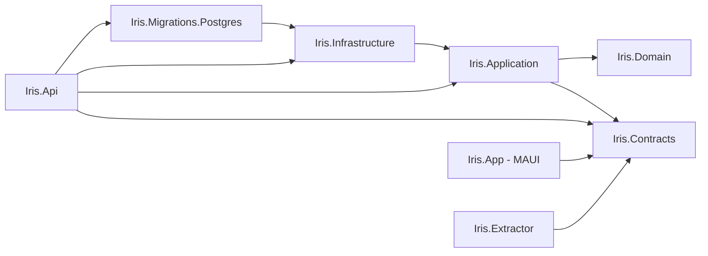

<!-- BEGIN GENERATED SECTION -->
<!-- Regenerate by re-running: rg "ProjectReference" -g "*.csproj" src tests
     This section is 100% mechanical — every edge below is a literal
     <ProjectReference> element, not an inference. Safe to fully replace on
     every pass. -->

## Solutions

- `Iris.sln` — backend + tests, builds with the .NET SDK alone.
- `Iris.App.sln` — adds the MAUI client, needs the `maui`/`maui-windows` workload.

## Edges (A → B means A has `<ProjectReference>` to B)

```text
Iris.Api               → Iris.Application, Iris.Infrastructure, Iris.Migrations.Postgres, Iris.Contracts
Iris.Migrations.Postgres → Iris.Infrastructure
Iris.Infrastructure     → Iris.Application
Iris.Application        → Iris.Domain, Iris.Contracts
Iris.Domain              → (none)
Iris.Contracts           → (none)
Iris.Extractor           → Iris.Contracts
Iris.App                 → Iris.Contracts

tests/Iris.Api.Tests.csproj         → Iris.Api
tests/Iris.Application.Tests.csproj → Iris.Application
tests/Iris.Domain.Tests.csproj      → Iris.Domain
tests/Iris.Extractor.Tests.csproj   → Iris.Extractor
```



## Notes

- Confirms the dependency direction stated in `README.md`
  ("`Api → Infrastructure → Application → Domain`"): verified true, plus the
  detail that `README.md` doesn't spell out — `Iris.Api` also depends directly
  on `Iris.Migrations.Postgres` and `Iris.Contracts`, and `Iris.Domain` has
  **zero** outgoing project references, confirming the hexagonal-purity rule
  in `.contex/01-decisions.md` at the build-graph level, not just by
  convention.
- `Iris.Extractor` and `Iris.App` are both leaves that depend only on
  `Iris.Contracts` — neither can see `Iris.Domain` or `Iris.Application`
  directly, which is why the extractor talks to the API over HTTP instead of
  calling handlers in-process (see `modules/iris-extractor.md`).
- `README.md`'s solution layout diagram does not list `Iris.Extractor` or
  `tests/Iris.Extractor.Tests` at all — flagged as a documentation gap in the
  Phase 1 assessment, not fixed here (fixing `README.md` is outside this
  layer's mandate; `.knowledge/` links to sources, it doesn't patch them).

<!-- END GENERATED SECTION -->
